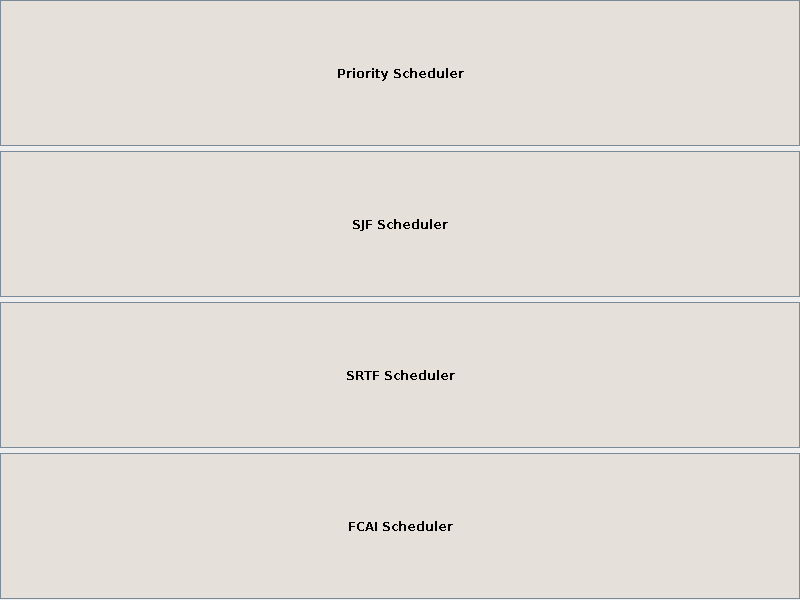
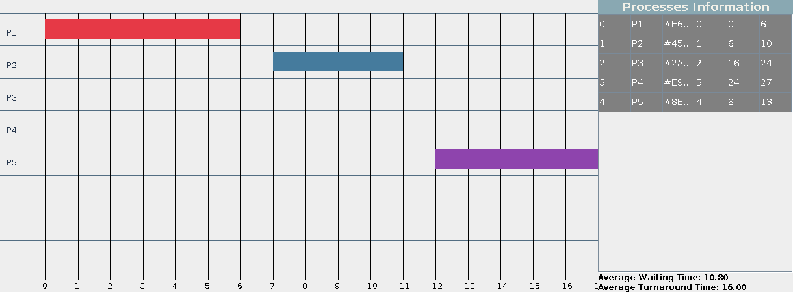
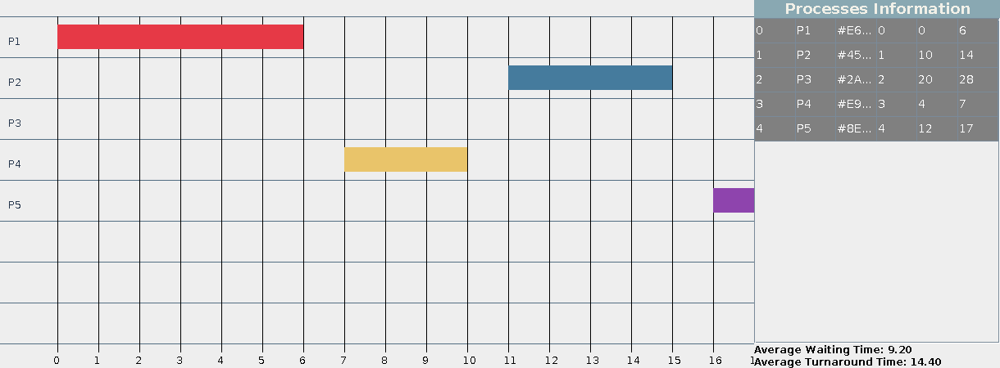
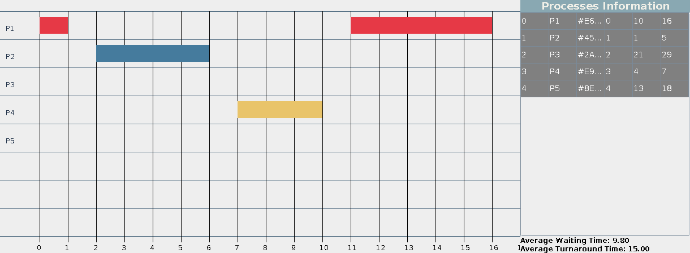
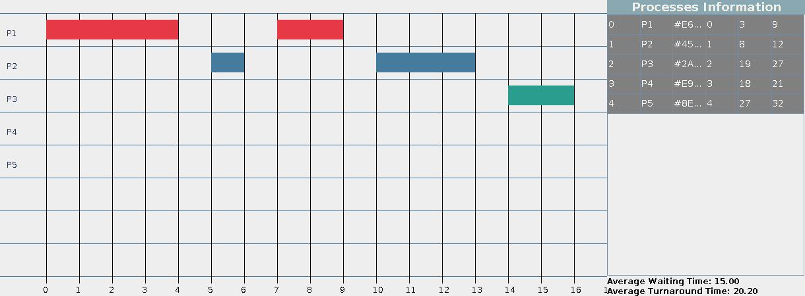

# 🖥️ CPU Scheduler

A Java implementation of classic CPU scheduling algorithms, with both a **console** version and a **Swing-based GUI** that visualizes execution as a Gantt-style timeline.

## Overview

This project simulates how an operating system's CPU scheduler decides which process runs next. You enter a set of processes (arrival time, burst time, priority, quantum), pick an algorithm, and the program computes the execution order along with waiting time and turnaround time for each process.

## ✨ Algorithms Implemented

- **Priority Scheduling** — runs the highest-priority available process first
- **Shortest Job First (SJF)** — runs the process with the shortest burst time first (non-preemptive)
- **Shortest Remaining Time First (SRTF)** — the preemptive version of SJF
- **FCAI Scheduling** — a custom hybrid algorithm that blends priority and remaining time into a single "FCAI factor" to pick the next process

All algorithms also support a configurable **context switching time** between processes.

## 🖼️ Screenshots

**Scheduler launcher**



**Priority Scheduler — Gantt timeline & process stats**



**SJF Scheduler**



**SRTF Scheduler**



**FCAI Scheduler**



Each scheduler window draws a color-coded timeline of process execution, plus a side panel with per-process arrival/waiting/turnaround time and the run's averages.

## 🛠️ Tech Stack

- **Language:** Java
- **GUI:** Java Swing (`javax.swing`, custom `JPanel` timeline rendering)
- **Build:** plain `javac` (no external dependencies)

## 📁 Project Structure

```
CPU-scheduler/
├── src/                     # Console (CLI) version
│   ├── Main.java
│   ├── models/
│   │   └── Process.java
│   └── schedulers/
│       ├── Scheduler.java
│       ├── PriorityScheduler.java
│       ├── SJFScheduler.java
│       ├── SRTFScheduler.java
│       └── FCAIScheduler.java
└── GUI/                     # Swing GUI version
    ├── GUIMain.java
    ├── SchedulerLauncherGUI.java
    ├── TimelinePanel.java
    ├── models/
    │   ├── Process.java
    │   └── ExecutionRange.java
    └── schedulers/
        ├── Scheduler.java
        ├── PriorityScheduler.java
        ├── SJFScheduler.java
        ├── SRTFScheduler.java
        └── FCAIScheduler.java
```

## 🚀 Getting Started

### Prerequisites
- **JDK 17+** installed (`java -version` / `javac -version` to check)

### Clone the repository
```bash
git clone https://github.com/OmarAbdelmonemSayed/CPU-scheduler.git
cd CPU-scheduler
```

### Run the GUI version
```bash
cd GUI
javac -d out models/*.java schedulers/*.java TimelinePanel.java SchedulerLauncherGUI.java GUIMain.java
java -cp out GUIMain
```
You'll be asked to enter processes in the terminal first; once submitted, the launcher window opens so you can pick an algorithm and view the results.

### Run the console-only version
```bash
cd src
javac -d out models/*.java schedulers/*.java Main.java
java -cp out Main
```

### Example input
```
Enter the number of processes: 3
Enter context switching time: 1
Process 1:
Name: P1
Color: E63946
Arrival Time: 0
Burst Time: 6
Priority: 2
Quantum: 4
...
```
`Color` is a 6-digit hex color code (without `#`) used to draw that process on the timeline.